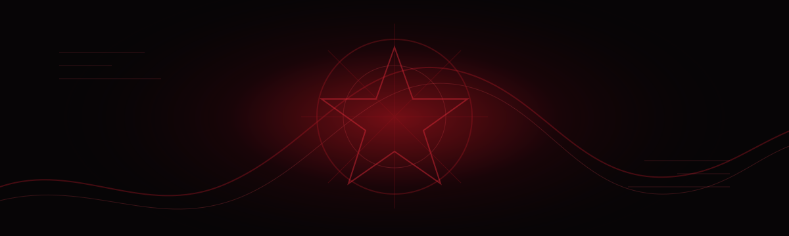
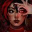
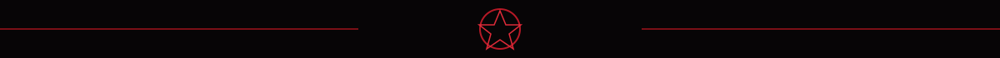
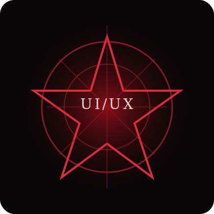

<div align="center">



<br />



# wrnati

### UI/UX Designer

interfaces com clima, intencao e um pouco de misterio

</div>



## sobre

Eu sou a **wrnati**.

Meu foco e moldar experiencias visuais: transformar ideia solta em tela, tela em fluxo, fluxo em algo que faz sentido para quem usa.

Este perfil tem uma estetica inspirada na **Aghata**, de Ordem Paranormal: escuro, vermelho, simbolico e meio ritualistico. A proposta nao e parecer comum. E parecer memoravel.

```text
area: UI/UX Design
especialidade: interfaces com personalidade
ritual favorito: organizar caos visual
missao: fazer o site sentir que tem alma
```

## o que eu desenho

- Identidade visual para paginas e produtos
- Landing pages com atmosfera propria
- Fluxos de usuario mais claros
- Wireframes e prototipos
- Interfaces com narrativa visual
- Ajustes de layout, hierarquia, ritmo e contraste

<div align="center">



</div>

## jeito de trabalhar

```text
1. entender o clima do projeto
2. descobrir o que a tela precisa dizer
3. organizar a experiencia
4. escolher cores, ritmo e contraste
5. lapidar ate parecer simples
```

## direcao visual

| elemento | intencao |
| --- | --- |
| vermelho escuro | energia, presenca, impacto |
| preto | misterio, foco, profundidade |
| simbolos | identidade e memorabilidade |
| espaco vazio | respiro e controle |
| contraste forte | leitura rapida e personalidade |

## projetos

Aqui entram trabalhos de UI/UX, telas, estudos visuais e ideias que merecem sair do rascunho.

```text
interfaces
experimentos visuais
prototipos
redesigns
identidades para paginas
```

## contato

<div align="center">

[](https://github.com/wrnati)

</div>


<div align="center">

<sub>
design nao e so deixar bonito. e fazer a tela olhar de volta.
</sub>

</div>
