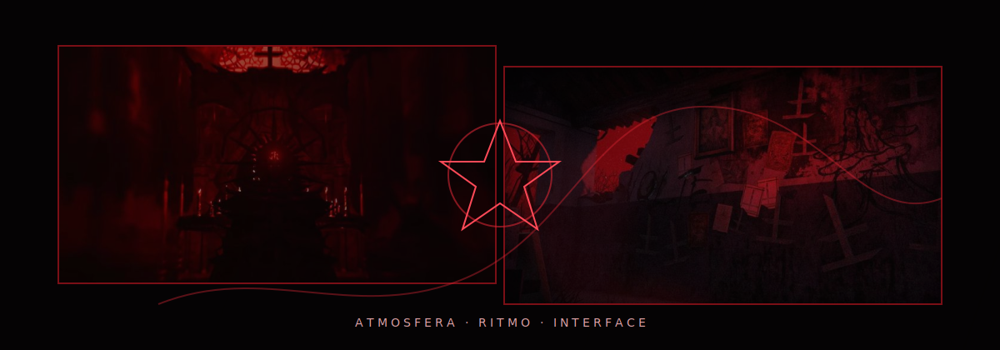
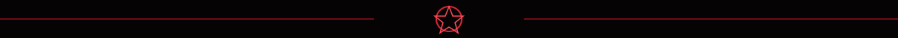

 

  <strong>interfaces com atmosfera, ritmo visual e aquele detalhe estranho que faz a tela ficar na memoria.</strong>

## o que eu faco

Eu desenho experiencias para sites e produtos digitais.

Meu foco nao e codigo.  
Meu foco e moldar a sensacao da interface: organizar o caos, escolher o clima, montar a hierarquia e fazer cada tela parecer intencional.

 

<strong>direcao visual</strong> · <strong>experiencia</strong> · <strong>acabamento</strong>

 
clima, fluxo, contraste, leitura, composicao e consistencia.

## clima do perfil

Inspirado na Aghata de Ordem Paranormal: escuro, vermelho, intenso e meio ritualistico.

 

  <code>funcao</code> 
  <strong>UI/UX Designer</strong>

  <code>missao</code> 
  <strong>dar forma visual para ideias</strong>

  <code>energia</code> 
  <strong>paranormal, elegante e caotica na medida certa</strong>

  <code>assinatura</code> 
  <strong>telas com personalidade</strong>

## como eu penso uma interface

  <strong>01.</strong> entender o clima 
  <strong>02.</strong> cortar o ruido 
  <strong>03.</strong> organizar o caminho 
  <strong>04.</strong> criar uma identidade visual forte 
  <strong>05.</strong> lapidar ate parecer natural

## projetos

Espaco para estudos visuais, redesigns, telas, experimentos e interfaces com uma pegada mais autoral.

  landing pages 
  redesigns 
  identidade para telas 
  prototipos 
  experimentos de UI

 

design nao e so deixar bonito. e fazer a tela parecer que sabe alguma coisa que voce nao sabe.

