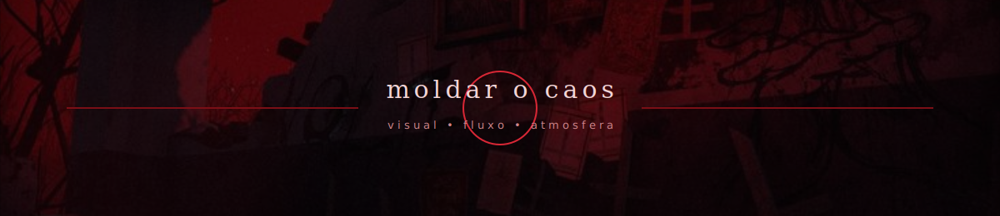

## presenca visual

Nem toda tela precisa gritar.  
Algumas so precisam puxar o olhar para o lugar certo.

Aqui, cada detalhe importa: atmosfera, respiro, contraste, ritmo e memoria visual.

 

<strong>direcao visual</strong> · <strong>experiencia</strong> · <strong>acabamento</strong>

 
onde o caos vira forma, e a forma vira sensacao.

## assinatura

Escuro, vermelho, intenso e meio ritualistico.  
Um clima inspirado na Aghata, mas guiado por design, composicao e intencao.

 

  <code>funcao</code> 
  <strong>UI/UX Designer</strong>

  <code>missao</code> 
  <strong>dar forma visual para ideias</strong>

  <code>energia</code> 
  <strong>paranormal, elegante e caotica na medida certa</strong>

  <code>assinatura</code> 
  <strong>telas com personalidade</strong>

## processo

  <strong>01.</strong> sentir o clima 
  <strong>02.</strong> cortar o ruido 
  <strong>03.</strong> organizar o caminho 
  <strong>04.</strong> criar uma identidade forte 
  <strong>05.</strong> lapidar ate parecer natural

## territorio

Landing pages, redesigns, identidades para telas, prototipos e experimentos de UI.

 
 

interfaces que nao parecem montadas por acaso.

 

design nao e so deixar bonito. e fazer a tela ficar um pouco inevitavel.

